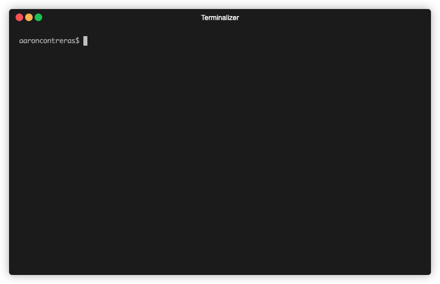

# TERMINAL CHESS

My take on this classic, built with Ruby.

## Requirements
- [Ruby](https://www.ruby-lang.org/en/) >= 2.6.5
- [Bundler](https://bundler.io/) >= 2.1.2

## Installation
- Clone the repo locally.
- `cd` into it.
- Run `bundle install`.

## Playing
- From the repo's root directory, run `bundle exec ruby chess_game_client.rb`
- If at any point during the game the Chess board's **colors are not visible**
  1. Go to the `Options menu`.
  2. Select `Switch terminal color mode`.
  3. Select a color mode that is supported by your terminal.
  
## Demo

## Thoughts & notes

### Gems used
- [tty-prompt](https://github.com/piotrmurach/tty-prompt)
  - Great for creating navigation menus and validating input.
- [tty-screen](https://github.com/piotrmurach/tty-screen)
  - Detects screen dimensions of the terminal.
- [tty-box](https://github.com/piotrmurach/tty-box)
  - Prints and aligns "textboxes" nicely.
- [paint](https://github.com/janlelis/paint)
  - Liked it better than 'colorize'. Gives more control over the colors you'd like to display
- [figlet](https://github.com/tim/figlet)
  - Creates pretty cool titles.
- [oj](https://github.com/ohler55/oj)
  - Found this great JSON serializer, give it a try as well!

### Features

#### Simple navigation
  - Use your arrow keys and `ENTER` to navigate throughout the game. You're here to play not to learn the navigation commands.

#### Which move should I pick next?
  - In order to make the game more accessible and user friendly, decided to generate all valid moves a player can make and display with `tty-prompt`. In order to  allow players to select their next move in a more visual, yet equally unambiguous way, decided to use a **special notation** for this game. It _inherits_ most of its components from [Figurine notation](https://en.wikipedia.org/wiki/Chess_notation#:~:text=Figurine%20algebraic%20notation%20(FAN)%20is,as%20in%20standard%20algebraic%20notation.). You'll pick it up in your very first move.
  - The way moves are displayed for selection, helps you both sort through move types by filter search and with arrow keys, always displaying the moves by an easy to remember precedence:
    1. Captures
    2. Special moves (En Passant and Castling)
    3. Standard moves (to an empty square)

#### Single and Multiplayer game modes.
  - When playing against the computer, it will always choose the next move of highest precendence on the list above.
  
#### Come back to a game later on.
  - Save and load options to come back to a specific point in a game where you've left off.

#### Colorful
  - Support for 4 different terminal color modes
    - True color (default/recommended)
    - 256 colors
    - 16 colors
    - 8 colors
  - You're able to choose whichever your terminal supports best.
  
### Project review
My initial approach towards this project was pretty messy and started getting very complex very quickly. After taking a hard step back and starting fresh, I decided to really take advantage of what OOP offers and created entities responsible for a specific task. My progress and tempo completing this project massively boosted after this and found an overall pleasant experience completing this. Definitely the biggest project I've worked on so far!

- Aaron Contreras, October 5th, 2020
